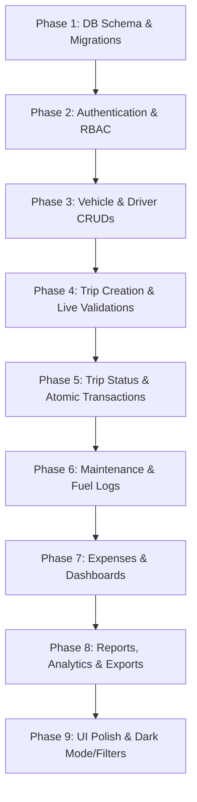

# Architecture Blueprint & Project Specifications: TransitOps & EcoSphere

This document serves as the master specification, database schema design, and technical architecture blueprint for the development of **TransitOps (Smart Transport Operations Platform)** and **EcoSphere (ESG Management Platform)**.

---

## 1. Architectural Decision: React (Vite) + Node.js/Express + PostgreSQL vs. Next.js

For enterprise platforms like TransitOps and EcoSphere, choosing **React (Vite) + Express + PostgreSQL** over **Next.js** is highly recommended. Here is the technical justification:

### Why Next.js is Not Necessary
* **No SEO Requirement:** Both systems are internal enterprise applications (ERP/CRM/Dashboard style) operating entirely behind authentication. Next.js's primary strengths—Server-Side Rendering (SSR), Static Site Generation (SSG), and SEO optimization—provide no benefit here.
* **Overhead of SSR on Data-Intensive UIs:** The UI consists of real-time data grids, dynamic step-by-step form wizards (like the Trip Dispatcher), active lists, and settings. Rendering these on the server adds round-trip latency and unnecessary complexity compared to a client-side Single Page Application (SPA).

### The Benefits of React (Vite) + Express + PostgreSQL
1. **Separation of Concerns:** A clean division between the frontend client (`Vite + React`) and the backend REST API (`Express`) allows for independent deployment, isolated scaling, and cleaner testing.
2. **Persistent Connection Pooling:** Express runs a long-lived node process, enabling persistent connection pooling to PostgreSQL (using `pg-pool` or `Sequelize/Prisma`). In Next.js (especially when deployed to serverless environments), connection pooling can be challenging, leading to database connection exhaustion.
3. **Deterministic Middleware Pipeline:** Writing custom, granular RBAC (Role-Based Access Control) middleware in Express is straightforward and highly robust compared to managing route handlers, server actions, and middleware edges in Next.js.
4. **Faster Local Development:** Vite provides near-instantaneous Hot Module Replacement (HMR) for single-page dashboard interfaces, ensuring a highly responsive development loop.

---

## 2. TransitOps: Smart Transport Operations Platform

### 2.1 Design System & UI Guidelines
Following the strict enterprise visual requirements (avoiding stereotypical "AI-SaaS" styles):
* **Layout:** Left sidebar navigation with a persistent header.
* **Palette:**
  * **Primary (Brand Color):** Deep Forest Green (`#234E3F`)
  * **Secondary / Card Backgrounds:** Warm Off-White (`#F5F3ED`)
  * **Text / Neutrals:** Charcoal / Dark Slate (`#252A27`)
  * **Accent / Warning:** Muted Amber (`#C58B32`)
* **Semantic Status Indicators:**
  * **Success:** Soft Forest Green / Mint
  * **Error / Critical:** Muted Red
  * **Warning / Expiring:** Muted Amber
* **Typography:** Professional, clean, and highly readable (e.g., *Inter* or *Outfit* via Google Fonts). Minimal margins/padding, focusing on dense, actionable data grids and clean tables.

---

### 2.2 Database Schema (PostgreSQL)

```sql
-- Enable UUID extension if required
CREATE EXTENSION IF NOT EXISTS "uuid-ossp";

-- 1. USERS & ROLES
CREATE TYPE user_role AS ENUM ('FLEET_MANAGER', 'DISPATCHER', 'SAFETY_OFFICER', 'FINANCIAL_ANALYST');
CREATE TYPE user_status AS ENUM ('ACTIVE', 'INACTIVE');

CREATE TABLE users (
    id SERIAL PRIMARY KEY,
    name VARCHAR(255) NOT NULL,
    email VARCHAR(255) UNIQUE NOT NULL,
    password_hash VARCHAR(255) NOT NULL,
    role user_role NOT NULL,
    status user_status DEFAULT 'ACTIVE',
    created_at TIMESTAMP WITH TIME ZONE DEFAULT CURRENT_TIMESTAMP,
    updated_at TIMESTAMP WITH TIME ZONE DEFAULT CURRENT_TIMESTAMP
);

-- 2. VEHICLE REGISTRY
CREATE TYPE vehicle_status AS ENUM ('AVAILABLE', 'ON_TRIP', 'IN_SHOP', 'RETIRED');

CREATE TABLE vehicles (
    id SERIAL PRIMARY KEY,
    registration_number VARCHAR(50) UNIQUE NOT NULL,
    name VARCHAR(100) NOT NULL,
    model VARCHAR(100) NOT NULL,
    type VARCHAR(50) NOT NULL, -- e.g., 'Van', 'Truck', 'Flatbed'
    maximum_load_capacity NUMERIC(10, 2) NOT NULL, -- in KG
    current_odometer NUMERIC(12, 2) NOT NULL DEFAULT 0.0,
    acquisition_cost NUMERIC(12, 2) NOT NULL,
    region VARCHAR(100) NOT NULL,
    status vehicle_status DEFAULT 'AVAILABLE',
    created_at TIMESTAMP WITH TIME ZONE DEFAULT CURRENT_TIMESTAMP,
    updated_at TIMESTAMP WITH TIME ZONE DEFAULT CURRENT_TIMESTAMP
);

-- 3. DRIVERS & SAFETY PROFILES
CREATE TYPE driver_status AS ENUM ('AVAILABLE', 'ON_TRIP', 'OFF_DUTY', 'SUSPENDED');

CREATE TABLE drivers (
    id SERIAL PRIMARY KEY,
    name VARCHAR(255) NOT NULL,
    license_number VARCHAR(100) UNIQUE NOT NULL,
    license_category VARCHAR(50) NOT NULL, -- e.g., 'Heavy Commercial', 'Light Commercial'
    license_expiry_date DATE NOT NULL,
    contact_number VARCHAR(50) NOT NULL,
    safety_score INT DEFAULT 100 CHECK (safety_score BETWEEN 0 AND 100),
    status driver_status DEFAULT 'AVAILABLE',
    created_at TIMESTAMP WITH TIME ZONE DEFAULT CURRENT_TIMESTAMP,
    updated_at TIMESTAMP WITH TIME ZONE DEFAULT CURRENT_TIMESTAMP
);

-- 4. TRIPS
CREATE TYPE trip_status AS ENUM ('DRAFT', 'DISPATCHED', 'COMPLETED', 'CANCELLED');

CREATE TABLE trips (
    id SERIAL PRIMARY KEY,
    trip_code VARCHAR(50) UNIQUE NOT NULL, -- e.g., 'TRP-102'
    source VARCHAR(255) NOT NULL,
    destination VARCHAR(255) NOT NULL,
    vehicle_id INT REFERENCES vehicles(id) ON DELETE RESTRICT,
    driver_id INT REFERENCES drivers(id) ON DELETE RESTRICT,
    cargo_weight NUMERIC(10, 2) NOT NULL, -- in KG
    planned_distance NUMERIC(10, 2) NOT NULL, -- in KM
    final_odometer NUMERIC(12, 2),
    fuel_consumed NUMERIC(8, 2), -- in Liters
    revenue NUMERIC(12, 2) DEFAULT 0.0,
    status trip_status DEFAULT 'DRAFT',
    created_at TIMESTAMP WITH TIME ZONE DEFAULT CURRENT_TIMESTAMP,
    dispatched_at TIMESTAMP WITH TIME ZONE,
    completed_at TIMESTAMP WITH TIME ZONE,
    updated_at TIMESTAMP WITH TIME ZONE DEFAULT CURRENT_TIMESTAMP
);

-- 5. MAINTENANCE LOGS
CREATE TYPE maintenance_status AS ENUM ('ACTIVE', 'COMPLETED');

CREATE TABLE maintenance_logs (
    id SERIAL PRIMARY KEY,
    vehicle_id INT REFERENCES vehicles(id) ON DELETE CASCADE,
    maintenance_type VARCHAR(100) NOT NULL, -- e.g., 'Oil Change', 'Brake Inspection'
    description TEXT,
    start_date DATE NOT NULL,
    end_date DATE,
    maintenance_cost NUMERIC(12, 2) NOT NULL DEFAULT 0.0,
    status maintenance_status DEFAULT 'ACTIVE',
    created_at TIMESTAMP WITH TIME ZONE DEFAULT CURRENT_TIMESTAMP,
    updated_at TIMESTAMP WITH TIME ZONE DEFAULT CURRENT_TIMESTAMP
);

-- 6. FUEL LOGS
CREATE TABLE fuel_logs (
    id SERIAL PRIMARY KEY,
    vehicle_id INT REFERENCES vehicles(id) ON DELETE CASCADE,
    trip_id INT REFERENCES trips(id) ON DELETE SET NULL,
    fuel_quantity_liters NUMERIC(8, 2) NOT NULL,
    fuel_cost NUMERIC(12, 2) NOT NULL,
    fuel_date DATE NOT NULL,
    odometer_reading NUMERIC(12, 2) NOT NULL,
    created_at TIMESTAMP WITH TIME ZONE DEFAULT CURRENT_TIMESTAMP
);

-- 7. EXPENSES
CREATE TYPE expense_type AS ENUM ('TOLL', 'MAINTENANCE', 'PARKING', 'PERMIT', 'OTHER');

CREATE TABLE expenses (
    id SERIAL PRIMARY KEY,
    vehicle_id INT REFERENCES vehicles(id) ON DELETE CASCADE,
    trip_id INT REFERENCES trips(id) ON DELETE SET NULL,
    expense_type expense_type NOT NULL,
    description TEXT,
    amount NUMERIC(12, 2) NOT NULL,
    expense_date DATE NOT NULL,
    created_at TIMESTAMP WITH TIME ZONE DEFAULT CURRENT_TIMESTAMP
);

-- Database Indexes for Optimization
CREATE INDEX idx_vehicles_registration_number ON vehicles(registration_number);
CREATE INDEX idx_vehicles_status ON vehicles(status);
CREATE INDEX idx_drivers_license_number ON drivers(license_number);
CREATE INDEX idx_drivers_status ON drivers(status);
CREATE INDEX idx_drivers_license_expiry_date ON drivers(license_expiry_date);
CREATE INDEX idx_trips_status ON trips(status);
CREATE INDEX idx_trips_vehicle_id ON trips(vehicle_id);
CREATE INDEX idx_trips_driver_id ON trips(driver_id);
CREATE INDEX idx_maintenance_logs_vehicle_id ON maintenance_logs(vehicle_id);
CREATE INDEX idx_maintenance_logs_status ON maintenance_logs(status);
CREATE INDEX idx_fuel_logs_vehicle_id ON fuel_logs(vehicle_id);
CREATE INDEX idx_expenses_vehicle_id ON expenses(vehicle_id);
```

---

### 2.3 Key Business Rules & Validations

#### Trip Dispatch Validation Matrix
Before transitioning a trip to `DISPATCHED`, the backend API must validate the following constraints in a single, transactional scope:
1. **Vehicle Existence:** The assigned vehicle must exist.
2. **Driver Existence:** The assigned driver must exist.
3. **Vehicle Availability:** The vehicle status must be `AVAILABLE` (reject if `ON_TRIP`, `IN_SHOP`, or `RETIRED`).
4. **Driver Availability:** The driver status must be `AVAILABLE` (reject if `ON_TRIP`, `OFF_DUTY`, or `SUSPENDED`).
5. **License Validity:** Driver's `license_expiry_date` must be $\ge$ the dispatch date.
6. **No Double Booking:** Neither the vehicle nor the driver can be referenced by any other trip currently in `DISPATCHED` status.
7. **Weight Capacity Guard:** The trip's `cargo_weight` must not exceed the vehicle's `maximum_load_capacity`.
   * *Validation error example:* `Cargo weight exceeds the vehicle's maximum load capacity by X KG.`

#### Atomic Dispatch Transaction (Concurrency Protection)
To prevent race conditions where two dispatchers dispatch the same vehicle or driver simultaneously:
```javascript
// Example Express/PostgreSQL transaction flow (using pg-pool connection)
const client = await pool.connect();
try {
  await client.query('BEGIN');

  // Select vehicle with row locking (SELECT FOR UPDATE)
  const vehicleRes = await client.query(
    'SELECT status, maximum_load_capacity FROM vehicles WHERE id = $1 FOR UPDATE',
    [vehicleId]
  );
  const vehicle = vehicleRes.rows[0];

  // Select driver with row locking (SELECT FOR UPDATE)
  const driverRes = await client.query(
    'SELECT status, license_expiry_date FROM drivers WHERE id = $1 FOR UPDATE',
    [driverId]
  );
  const driver = driverRes.rows[0];

  // Execute all validations...
  if (vehicle.status !== 'AVAILABLE') throw new Error('Vehicle is not available for dispatch.');
  if (driver.status !== 'AVAILABLE') throw new Error('Driver is currently unavailable.');
  if (new Date(driver.license_expiry_date) < new Date()) throw new Error('Driver license has expired.');
  if (cargoWeight > vehicle.maximum_load_capacity) {
     throw new Error(`Cargo weight exceeds the vehicle's maximum load capacity by ${cargoWeight - vehicle.maximum_load_capacity} KG.`);
  }

  // Perform updates
  await client.query('UPDATE trips SET status = \'DISPATCHED\', dispatched_at = NOW() WHERE id = $1', [tripId]);
  await client.query('UPDATE vehicles SET status = \'ON_TRIP\' WHERE id = $1', [vehicleId]);
  await client.query('UPDATE drivers SET status = \'ON_TRIP\' WHERE id = $1', [driverId]);

  await client.query('COMMIT');
} catch (error) {
  await client.query('ROLLBACK');
  throw error;
} finally {
  client.release();
}
```

#### Trip Completion Workflow
When marking a trip `COMPLETED`:
* Input `final_odometer` and `fuel_consumed` are required.
* **Validate:** `final_odometer >= vehicle.current_odometer`.
* Calculate actual distance travelled: `distance = final_odometer - vehicle.current_odometer`.
* **State Updates (Atomic Transaction):**
  * `trips` table: Update `status = 'COMPLETED'`, `final_odometer`, `fuel_consumed`, and `completed_at = NOW()`.
  * `vehicles` table: Update `current_odometer = final_odometer` and `status = 'AVAILABLE'`.
  * `drivers` table: Update `status = 'AVAILABLE'`.
  * Create auto-linked fuel log using the recorded `fuel_consumed` value.

#### Maintenance Lifecycle
* **Entering Maintenance:** Creating an `ACTIVE` maintenance log immediately changes the vehicle's status to `IN_SHOP`, removing it from the eligible trip-dispatch selection pool.
* **Exiting Maintenance:** Setting the maintenance status to `COMPLETED` updates the vehicle's status to `AVAILABLE` (unless the vehicle has been explicitly marked `RETIRED`).

---

### 2.4 Analytical Calculations & Formulas

* **Fuel Efficiency:**
  $$\text{Fuel Efficiency (KM/L)} = \frac{\text{Distance Travelled (KM)}}{\text{Fuel Consumed (Liters)}}$$
  *Implementation detail:* Ensure protection against division-by-zero errors when fuel consumed is 0.

* **Fleet Utilization:**
  $$\text{Fleet Utilization \%} = \frac{\text{Vehicles with status 'ON\_TRIP'}}{\text{Total Active Non-Retired Vehicles}} \times 100$$

* **Total Operational Cost:**
  $$\text{Total Operational Cost} = \text{Sum of all linked Fuel Costs} + \text{Sum of all completed Maintenance Costs}$$

* **Vehicle ROI:**
  $$\text{Vehicle ROI} = \frac{\text{Total Trip Revenue} - (\text{Total Maintenance Cost} + \text{Total Fuel Cost})}{\text{Acquisition Cost}}$$
  *Implementation detail:* Guard against `Acquisition Cost = 0` to prevent database exceptions.

---

### 2.5 Smart Dispatch Recommendation Engine (V2 Feature)
Once core functionalities are built, the platform will offer a **Smart Dispatch Recommendation Engine** on the trip creation screen:
* Suggests the optimal vehicle for a given cargo weight and route distance.
* Evaluates all `AVAILABLE` vehicles.
* Eliminates vehicles where `maximum_load_capacity < cargo_weight`.
* Ranks eligible vehicles using a recommendation score calculated from:
  1. **Capacity Fit:** Minimizes excess empty space (e.g., sending a 500 KG van for a 450 KG payload instead of a 2000 KG flatbed).
  2. **Historical Fuel Efficiency:** Prefers vehicles with lower consumption profiles.
  3. **Operational Cost Ratio:** Factors in pending maintenance frequencies.

---

## 3. EcoSphere: ESG Management Platform

EcoSphere is a unified ESG sustainability portal that integrates environmental reporting, social activities, corporate governance, and gamified employee engagement.

### 3.1 EcoSphere Database Schema (PostgreSQL)

```sql
-- 1. MASTER DATA
CREATE TABLE departments (
    id SERIAL PRIMARY KEY,
    name VARCHAR(255) NOT NULL,
    code VARCHAR(50) UNIQUE NOT NULL,
    head VARCHAR(255),
    parent_department_id INT REFERENCES departments(id) ON DELETE SET NULL,
    employee_count INT NOT NULL DEFAULT 0,
    status VARCHAR(50) DEFAULT 'ACTIVE'
);

CREATE TYPE category_type AS ENUM ('CSR_ACTIVITY', 'CHALLENGE');

CREATE TABLE categories (
    id SERIAL PRIMARY KEY,
    name VARCHAR(255) NOT NULL,
    type category_type NOT NULL,
    status VARCHAR(50) DEFAULT 'ACTIVE'
);

CREATE TABLE emission_factors (
    id SERIAL PRIMARY KEY,
    activity_type VARCHAR(255) NOT NULL, -- e.g., 'Electricity Consumption', 'Fleet Travel'
    unit VARCHAR(50) NOT NULL, -- e.g., 'kWh', 'KM'
    co2e_per_unit NUMERIC(10, 6) NOT NULL, -- kg CO2e per unit
    status VARCHAR(50) DEFAULT 'ACTIVE'
);

CREATE TABLE products (
    id SERIAL PRIMARY KEY,
    name VARCHAR(255) NOT NULL,
    sku VARCHAR(100) UNIQUE NOT NULL,
    carbon_footprint_kg_co2e NUMERIC(10, 2) DEFAULT 0.0,
    water_footprint_liters NUMERIC(10, 2) DEFAULT 0.0,
    recycled_content_percentage NUMERIC(5, 2) DEFAULT 0.0
);

CREATE TABLE environmental_goals (
    id SERIAL PRIMARY KEY,
    title VARCHAR(255) NOT NULL,
    target_metric VARCHAR(100) NOT NULL, -- e.g., 'Carbon Emissions', 'Waste Reduction'
    target_value NUMERIC(12, 2) NOT NULL,
    current_value NUMERIC(12, 2) DEFAULT 0.0,
    deadline DATE NOT NULL,
    status VARCHAR(50) DEFAULT 'ACTIVE'
);

CREATE TABLE esg_policies (
    id SERIAL PRIMARY KEY,
    title VARCHAR(255) NOT NULL,
    content TEXT NOT NULL,
    version VARCHAR(50) NOT NULL,
    effective_date DATE NOT NULL,
    status VARCHAR(50) DEFAULT 'ACTIVE'
);

CREATE TABLE badges (
    id SERIAL PRIMARY KEY,
    name VARCHAR(100) NOT NULL,
    description TEXT,
    unlock_rule JSONB NOT NULL, -- e.g., {"xp_required": 500, "completed_challenges": 5}
    icon VARCHAR(255) NOT NULL
);

CREATE TABLE rewards (
    id SERIAL PRIMARY KEY,
    name VARCHAR(100) NOT NULL,
    description TEXT,
    points_required INT NOT NULL,
    stock INT NOT NULL DEFAULT 0,
    status VARCHAR(50) DEFAULT 'ACTIVE'
);

-- 2. TRANSACTIONAL DATA
CREATE TABLE carbon_transactions (
    id SERIAL PRIMARY KEY,
    department_id INT REFERENCES departments(id),
    emission_factor_id INT REFERENCES emission_factors(id),
    activity_value NUMERIC(12, 2) NOT NULL, -- raw quantity (e.g., 5000 kWh)
    calculated_emissions_kg_co2e NUMERIC(12, 2) NOT NULL, -- automatically calculated
    transaction_date DATE NOT NULL,
    source_reference VARCHAR(255) -- Links to Linked Purchase, Manufacturing, or Fleet records
);

CREATE TABLE csr_activities (
    id SERIAL PRIMARY KEY,
    title VARCHAR(255) NOT NULL,
    category_id INT REFERENCES categories(id),
    description TEXT,
    date DATE NOT NULL,
    allocated_points INT NOT NULL DEFAULT 50
);

CREATE TYPE participation_status AS ENUM ('PENDING', 'APPROVED', 'REJECTED');

CREATE TABLE employee_participations (
    id SERIAL PRIMARY KEY,
    employee_id INT REFERENCES users(id),
    csr_activity_id INT REFERENCES csr_activities(id),
    proof_document_url VARCHAR(555),
    approval_status participation_status DEFAULT 'PENDING',
    points_earned INT DEFAULT 0,
    completion_date DATE,
    reviewed_by INT REFERENCES users(id)
);

CREATE TYPE challenge_status AS ENUM ('DRAFT', 'ACTIVE', 'UNDER_REVIEW', 'COMPLETED', 'ARCHIVED');

CREATE TABLE challenges (
    id SERIAL PRIMARY KEY,
    title VARCHAR(255) NOT NULL,
    category_id INT REFERENCES categories(id),
    description TEXT,
    xp_reward INT NOT NULL DEFAULT 100,
    difficulty VARCHAR(50) NOT NULL, -- e.g., 'Easy', 'Medium', 'Hard'
    evidence_required BOOLEAN DEFAULT TRUE,
    deadline DATE,
    status challenge_status DEFAULT 'DRAFT'
);

CREATE TABLE challenge_participations (
    id SERIAL PRIMARY KEY,
    challenge_id INT REFERENCES challenges(id),
    employee_id INT REFERENCES users(id),
    progress_percentage INT DEFAULT 0,
    proof_document_url VARCHAR(555),
    approval_status participation_status DEFAULT 'PENDING',
    xp_awarded INT DEFAULT 0,
    completed_at TIMESTAMP WITH TIME ZONE
);

CREATE TABLE policy_acknowledgements (
    id SERIAL PRIMARY KEY,
    policy_id INT REFERENCES esg_policies(id),
    employee_id INT REFERENCES users(id),
    acknowledged_at TIMESTAMP WITH TIME ZONE DEFAULT CURRENT_TIMESTAMP
);

CREATE TABLE audits (
    id SERIAL PRIMARY KEY,
    title VARCHAR(255) NOT NULL,
    audit_date DATE NOT NULL,
    auditor_name VARCHAR(255) NOT NULL,
    score INT CHECK (score BETWEEN 0 AND 100),
    report_url VARCHAR(555)
);

CREATE TYPE compliance_severity AS ENUM ('LOW', 'MEDIUM', 'HIGH', 'CRITICAL');
CREATE TYPE compliance_status AS ENUM ('OPEN', 'RESOLVED', 'OVERDUE');

CREATE TABLE compliance_issues (
    id SERIAL PRIMARY KEY,
    audit_id INT REFERENCES audits(id) ON DELETE CASCADE,
    severity compliance_severity NOT NULL,
    description TEXT NOT NULL,
    owner_id INT REFERENCES users(id),
    due_date DATE NOT NULL,
    status compliance_status DEFAULT 'OPEN',
    created_at TIMESTAMP WITH TIME ZONE DEFAULT CURRENT_TIMESTAMP
);

CREATE TABLE department_scores (
    id SERIAL PRIMARY KEY,
    department_id INT REFERENCES departments(id) ON DELETE CASCADE,
    environmental_score NUMERIC(5, 2) NOT NULL DEFAULT 0.0,
    social_score NUMERIC(5, 2) NOT NULL DEFAULT 0.0,
    governance_score NUMERIC(5, 2) NOT NULL DEFAULT 0.0,
    total_score NUMERIC(5, 2) NOT NULL DEFAULT 0.0,
    calculated_at TIMESTAMP WITH TIME ZONE DEFAULT CURRENT_TIMESTAMP
);
```

---

### 3.2 EcoSphere Business Rules

1. **Auto Emission Calculation:**
   Whenever a carbon transaction is recorded (whether manually or auto-triggered from purchase/logistics events), the platform must automatically calculate the emissions value:
   $$\text{Calculated CO2e (kg)} = \text{Activity Value} \times \text{Emission Factor rate}$$
2. **Evidence-Based CSR Approvals:**
   If the *Evidence Required* toggle is active in settings, CSR activities and Challenges cannot transition to `APPROVED` or reward points unless a valid document path/URL is present in the database fields.
3. **Reward Point Redemption Ledger:**
   Redeeming a reward check:
   * **Condition:** User's cumulative points balance must be $\ge$ reward `points_required`.
   * **Condition:** Reward `stock` must be $> 0$.
   * **Execution (Transaction):** Deduct the required points from the employee's profile ledger and decrement the reward stock count by 1.
4. **Automated Badge Unlocking Engine:**
   When an employee gains XP or completes a challenge, an asynchronous or hook event evaluates matching `badges.unlock_rule` patterns. If conditions are met, a badge is assigned automatically.
5. **Organizational ESG Formula:**
   To calculate overall corporate ESG scores:
   $$\text{Overall ESG Score} = (E_{\text{score}} \times 0.4) + (S_{\text{score}} \times 0.3) + (G_{\text{score}} \times 0.3)$$
   *(Weights are adjustable in administration configuration settings).*

---

## 4. Development Implementation Phases



### Phase 1: Database Setup
* Provision PostgreSQL database.
* Execute the schema script and establish constraints, index optimizations, and cascade behaviors.

### Phase 2: Auth and Roles Setup
* Implement user endpoints.
* Implement JWT/Session authentication.
* Secure endpoints utilizing Express middleware targeting the roles: `FLEET_MANAGER`, `DISPATCHER`, `SAFETY_OFFICER`, and `FINANCIAL_ANALYST`.

### Phase 3: Vehicle & Driver Registry
* Establish registry routes with strict uniqueness validation on vehicle plates/registration numbers and driver licenses.

### Phase 4: Trip Dispatch Core
* Set up trip drafting, resource validations, and transactional code block implementations for double-assignment guards.

### Phase 5: Expense, Fuel & Maintenance
* Build secondary operational flows, calculations (Fuel efficiency, Fleet utilization percentages), and CSV data exporter services.

---

## 5. Repository File Structure & Git Status

Below is the audit mapping of files tracked on GitHub vs. files excluded locally (untracked) to ensure codebase integrity and score rules:

| Path | File / Folder | Git Status | Purpose / Description |
|---|---|---|---|
| `/` | `README.md` | **TRACKED** | Master specifications, architecture blueprint, and file structures. |
| `/` | `.gitignore` | **TRACKED** | Root exclusions file to prevent code leakage. |
| `/` | `TransitOps.zip` | **EXCLUDED** | Exported clean codebase zip for sharing. |
| `backend/` | `package.json` | **TRACKED** | Node.js backend dependencies and project scripts. |
| `backend/` | `package-lock.json` | **TRACKED** | Backend locked dependency tree. |
| `backend/` | `server.js` | **EXCLUDED** | Express entry point file. |
| `backend/` | `.env` | **EXCLUDED** | Private environment database and secret keys. |
| `backend/` | `src/` | **EXCLUDED** | REST controller handlers, validation middlewares, routes, and pool configurations. |
| `backend/` | `scripts/` | **EXCLUDED** | Database seeders and dummy data populations. |
| `backend/` | `tests/` | **EXCLUDED** | Backend integration test suites. |
| `frontend/` | `package.json` | **TRACKED** | React frontend dependencies and run commands. |
| `frontend/` | `package-lock.json` | **TRACKED** | Frontend locked dependency tree. |
| `frontend/` | `vite.config.js` | **TRACKED** | Vite compiler and dev server proxy settings. |
| `frontend/` | `.gitignore` | **TRACKED** | Frontend project ignores. |
| `frontend/` | `.oxlintrc.json` | **TRACKED** | Oxlint rules for styling and code checks. |
| `frontend/` | `README.md` | **TRACKED** | Scaffolded client description. |
| `frontend/` | `index.html` | **EXCLUDED** | Vite index HTML template. |
| `frontend/` | `src/` | **EXCLUDED** | React page routes, Odoo styling system, context hooks, and API request functions. |
| `frontend/` | `public/` | **EXCLUDED** | SVG icons and visual templates. |
| `frontend/` | `dist/` | **EXCLUDED** | Compiled production bundle. |

